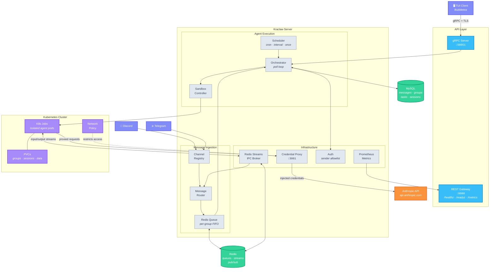

# 🐙 Kraclaw

**K8s-native AI agent orchestrator.** Go rewrite of [nanoclaw](https://github.com/qwibitai/nanoclaw).

Kraclaw turns a Kubernetes cluster into a managed runtime for AI agents. It runs Claude agents in fully isolated K8s Jobs — each with its own filesystem, network policy, and resource limits — while handling the hard parts: multi-channel messaging, credential injection, scheduled tasks, and real-time observability. Think of it as a control plane for conversational AI workloads that treats every agent like a proper cloud-native citizen.

---

## 🏗️ Architecture

Messages arrive from chat platforms (Discord, Telegram), get routed through a per-group Redis queue, and trigger sandboxed K8s Jobs where Claude agents execute. Agents communicate back through Redis Streams IPC, and results are routed to the originating channel. A gRPC API exposes five services (Admin, Group, Task, Channel, Sandbox) for programmatic control, with a Bubbletea TUI as the primary operator interface.



---

## ✨ Features

**Sandboxing & Isolation**
- **K8s-native sandboxing** — Every agent runs in its own Kubernetes Job with PVC-backed filesystem, resource limits, and network policies enforcing strict isolation between groups
- **Credential proxy** — A dedicated HTTP reverse proxy injects API keys into agent requests, locked down by network policy so only agent pods can reach it

**Messaging & Routing**
- **Multi-channel messaging** — Pluggable channel system with a registry pattern, shipping Discord and Telegram support out of the box
- **Per-group queuing** — Redis-backed message queues ensure ordered delivery and prevent cross-group interference
- **Redis Streams IPC** — Real-time bidirectional agent communication via XREADGROUP with exactly-once delivery semantics

**Scheduling & Control**
- **Scheduled tasks** — Cron, interval, and one-time task scheduling with drift-proof anchoring and persistent state across restarts
- **Sender allowlist** — Per-group access control stored in MySQL, restricting who can interact with each agent group
- **gRPC API** — Five services (Admin, Group, Task, Channel, Sandbox) exposed over gRPC with a REST gateway for flexibility

**Observability**
- **TUI dashboard** — Real-time Bubbletea-based monitoring of sandboxes, groups, tasks, and system events over gRPC
- **Prometheus metrics** — Built-in `/metrics` endpoint with health probes (`/healthz`, `/readyz`) for production readiness

**CI/CD**
- **GitHub Actions CI** — Split unit and Docker-based integration test workflows gate container builds with race detection on both test stages

---

## 🚀 Quick Start

### 📋 Prerequisites

- Go 1.26+
- MySQL 8+
- Redis (latest)
- Kubernetes cluster with client access
- Docker Engine (for Docker-based integration tests)

### 🔧 Build

```bash
make build          # Server binary
make build-tui      # TUI client
make test           # Run all tests
```

### ⚙️ Configure

Kraclaw is configured entirely via environment variables:

<details>
<summary>Environment variables reference</summary>

| Variable | Required | Default | Description |
|----------|----------|---------|-------------|
| `MYSQL_DSN` | Yes | — | MySQL connection string |
| `AGENT_IMAGE` | Yes | — | Container image for agent pods |
| `REDIS_URL` | No | `redis://localhost:6379` | Redis connection URL |
| `K8S_NAMESPACE` | No | `kraclaw` | Kubernetes namespace for Jobs |
| `GRPC_ADDR` | No | `:50051` | gRPC listen address |
| `REST_ADDR` | No | `:8080` | REST gateway listen address |
| `PROXY_ADDR` | No | `:3001` | Credential proxy listen address |
| `ANTHROPIC_API_KEY` | No | — | API key injected by credential proxy |
| `MAX_CONCURRENT` | No | `5` | Max concurrent sandbox Jobs |
| `IDLE_TIMEOUT` | No | `30m` | Sandbox idle timeout |
| `DISCORD_TOKEN` | No | — | Discord bot token |
| `TELEGRAM_TOKEN` | No | — | Telegram bot token |
| `ASSISTANT_NAME` | No | `Kraclaw` | Bot display name |
| `TZ` | No | `UTC` | Timezone for message formatting |
| `LOG_LEVEL` | No | `info` | Log level (debug, info, warn, error) |
| `LOG_FORMAT` | No | `json` | Log format (json, text) |

</details>

### ▶️ Run

```bash
# Local development
export MYSQL_DSN="user:pass@tcp(localhost:3306)/kraclaw?parseTime=true"
export AGENT_IMAGE="registry.local/agent:latest"
export REDIS_URL="redis://localhost:6379"
make run

# TUI client
./kraclaw-tui --server http://localhost:8080
```

### ☸️ Deploy to Kubernetes

```bash
# Build and push container image
make docker-build docker-push

# Install via Helm (see helm/README.md for full configuration)
helm install kraclaw ./helm -n kraclaw --create-namespace -f helm/values-prod.yaml
```

---

## 📁 Project Structure

```
kraclaw/
├── cmd/
│   ├── kraclaw/              # Server binary
│   └── kraclaw-tui/          # TUI client binary
├── internal/
│   ├── config/               # envconfig-based configuration
│   ├── server/               # gRPC server + REST gateway
│   ├── store/                # Store interfaces + MySQL implementation
│   ├── queue/                # Redis-backed per-group message queue
│   ├── ipc/                  # Redis Streams IPC broker
│   ├── sandbox/              # K8s Job lifecycle controller
│   ├── channel/              # Channel interface + registry
│   │   ├── discord/          # Discord bot
│   │   └── telegram/         # Telegram bot
│   ├── router/               # Message formatting + outbound routing
│   ├── auth/                 # Sender allowlist
│   ├── scheduler/            # Task scheduler (cron/interval/once)
│   ├── credproxy/            # Credential proxy
│   ├── orchestrator/         # Top-level wiring + message loop
│   └── metrics/              # Prometheus metrics
├── agent/                    # TypeScript agent (runs inside K8s Jobs)
├── proto/kraclaw/v1/         # Protobuf service definitions
├── migrations/               # MySQL migrations (golang-migrate)
├── integration/              # Docker-based backend integration tests
├── helm/                     # Helm chart for Kubernetes deployment
├── argocd/                   # ArgoCD application manifest
├── .github/workflows/        # CI/CD pipeline
├── Dockerfile
└── Makefile
```

---

## 🔌 Ports

| Port | Protocol | Purpose |
|------|----------|---------|
| 50051 | gRPC | TUI client and programmatic access |
| 8080 | HTTP | REST gateway, health probes (`/healthz`, `/readyz`), metrics |
| 3001 | HTTP | Credential proxy (agent pods only, network policy restricted) |

---

## 🧪 Testing

```bash
make test           # All tests (unit + integration)
make test-short     # Unit tests only
make test-integration # Integration tests only (Docker required)
```

- **Redis tests** use [miniredis](https://github.com/alicebob/miniredis) (in-memory)
- **MySQL tests** use [go-sqlmock](https://github.com/DATA-DOG/go-sqlmock)
- **K8s tests** use [client-go/kubernetes/fake](https://pkg.go.dev/k8s.io/client-go/kubernetes/fake)
- **Backend integration tests** use [dockertest](https://github.com/ory/dockertest) to spin up ephemeral **MySQL 8** and **Redis 7** containers

### 🐳 Docker-based Integration Tests

Kraclaw includes backend integration tests under `integration/` that validate real MySQL and Redis behavior using Docker containers.

**Prerequisites**
- Docker Engine installed and running (`docker version` succeeds)
- Ability to pull images from Docker Hub (`mysql:8.0` and `redis:7-alpine`)

**Run integration tests**

```bash
# Integration tests only
make test-integration

# Or run all tests (includes integration)
make test
```

Notes:
- Integration tests are skipped automatically when running with `-short` (for example via `make test-short`)
- If Docker is unavailable, integration tests are skipped rather than failing the whole test run
- GitHub Actions runs both unit tests (`go test -short`) and Docker-based integration tests on pushes and pull requests to `main`

---

## 📜 License

MIT
